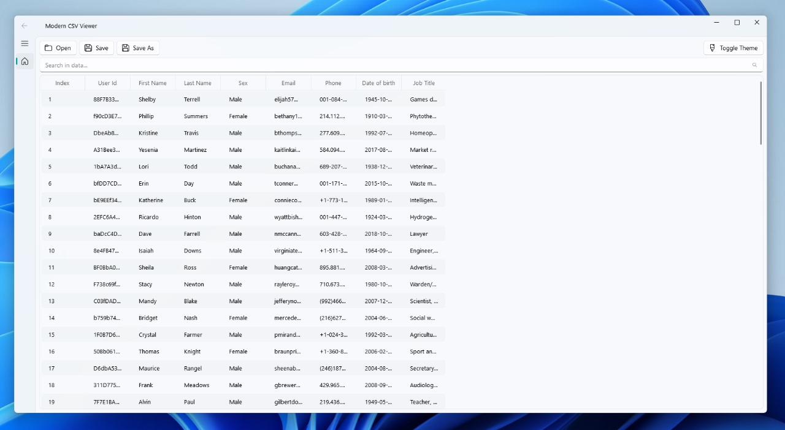
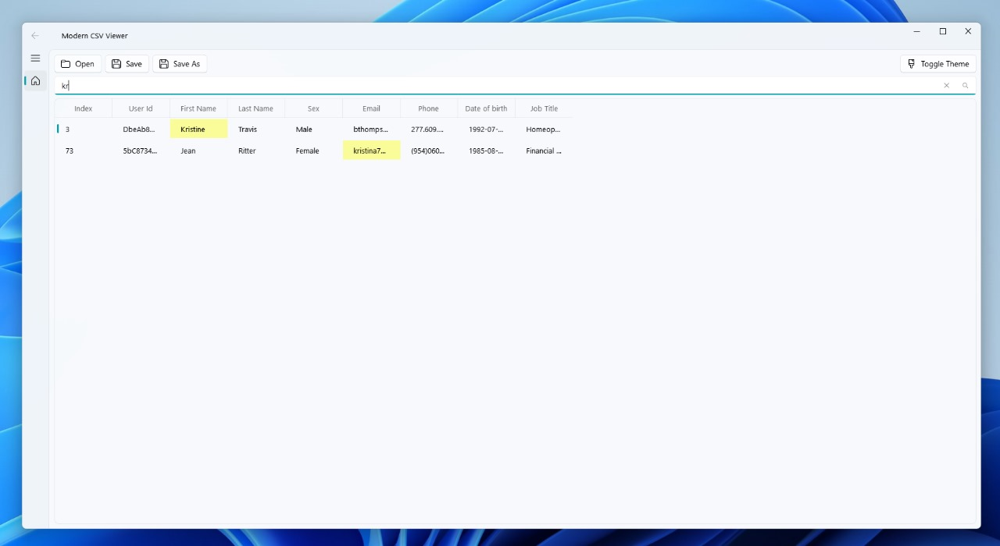

# Modern CSV Viewer

A modern and user-friendly CSV viewer application built with Python, PyQt5, and Fluent Widgets.

# Screenshots





## Features

- Modern Fluent Design interface
- CSV file loading with custom delimiter support
- Table view with editing capabilities
- Row operations (add new row, delete rows)
- Column operations (delete columns)
- Search and filter functionality
- Light/Dark theme toggle
- File operations (Open, Save, Save As)

## Requirements

- Python 3.8 or higher
- Dependencies listed in `requirements.txt`

## Installation

1. Clone this repository
2. Create a virtual environment:
   ```bash
   python -m venv .venv
   ```
3. Activate the virtual environment:
   - Windows:
     ```bash
     .venv\Scripts\activate
     ```
   - Linux/Mac:
     ```bash
     source .venv/bin/activate
     ```
4. Install dependencies:
   ```bash
   pip install -r requirements.txt
   ```

## Usage

Run the application:
```bash
python src/main.py
```

